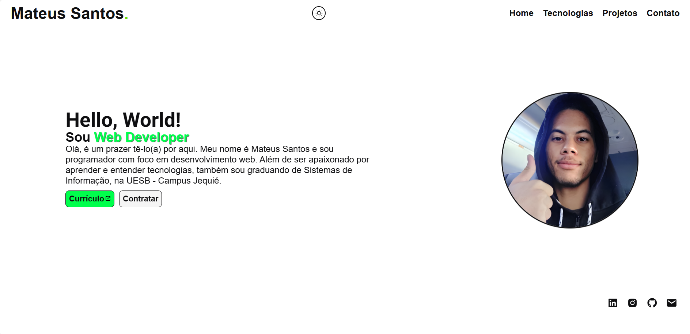

# Mateus Santos

</img>

# Portfolio - 01 

Este projeto é uma aplicação web desenvolvida que apresenta de forma clara e objetiva quem sou eu, quais são as minhas habilidades, competências e tecnologias que utilizo ou tenho conhecimento. O objetivo desse projeto, para além de servir como uma vitrine para o meu perfil profissional, foi também colocar em prática alguns dos conhecimentos que adiquire ao longo do tempo.

## 🚀 Tecnologias Utilizadas
 - **JavaScript:** linguagem de programação utilizada para melhorar a interatividade.
 - **HTML:** liguagem utilizada para a estruturação semântica do conteúdo.
 - **CSS:** linguagem utilizada para a estilização.

## 📄 Licença
Este projeto está sob a licença MIT. Consulte o arquivo LICENSE para mais informações.